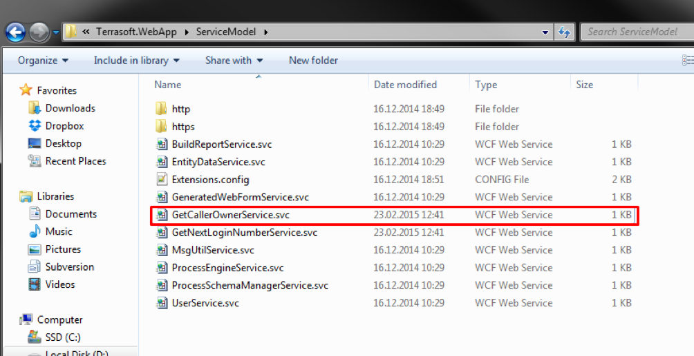
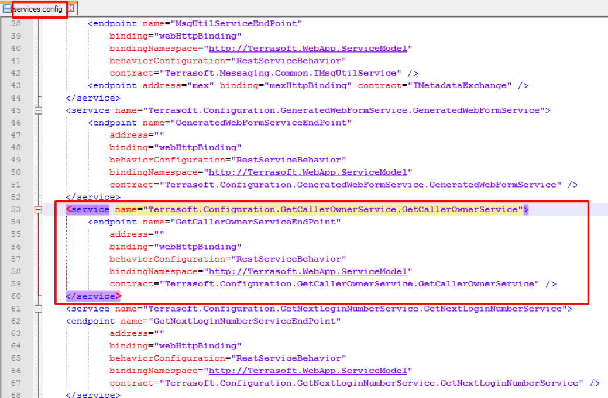
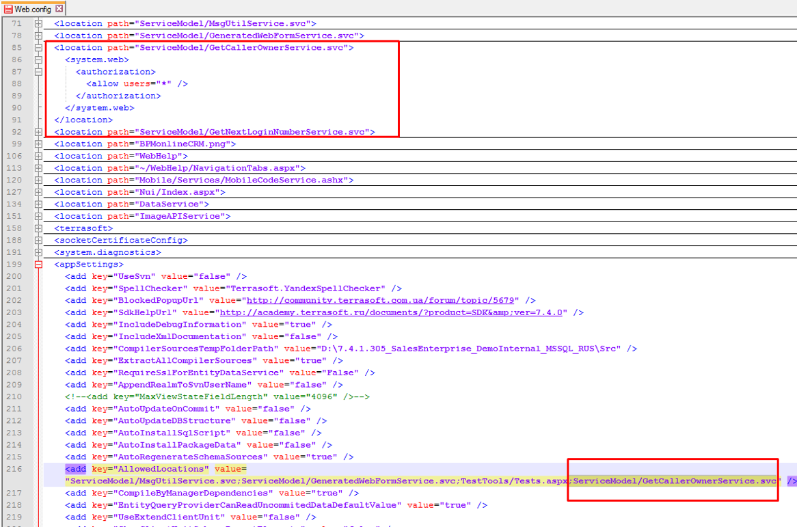

# GetCallerOwnerService

Установить файл [GetCallerOwnerService+Mob.md](GetCallerOwnerService+Mob.md) в `Terrasoft.WebApp/ServiceModel/`


Добавить в файле `Terrasoft.WebApp/ServiceModel/https/services.config` код

```
	<service name="Terrasoft.Configuration.GetCallerOwnerService.GetCallerOwnerService">
		<endpoint name="GetCallerOwnerServiceEndPoint"
			address="" 
			binding="webHttpBinding"
			behaviorConfiguration="RestServiceBehavior"
			bindingNamespace="http://Terrasoft.WebApp.ServiceModel"
			contract="Terrasoft.Configuration.GetCallerOwnerService.GetCallerOwnerService" />
	</service>
```



Добавить в файле `Terrasoft.WebApp/Web.config` код:

```
  <location path="ServiceModel/GetCallerOwnerService.svc">
    <system.web>
      <authorization>
        <allow users="*" />
      </authorization>
    </system.web>
  </location>
```


   

